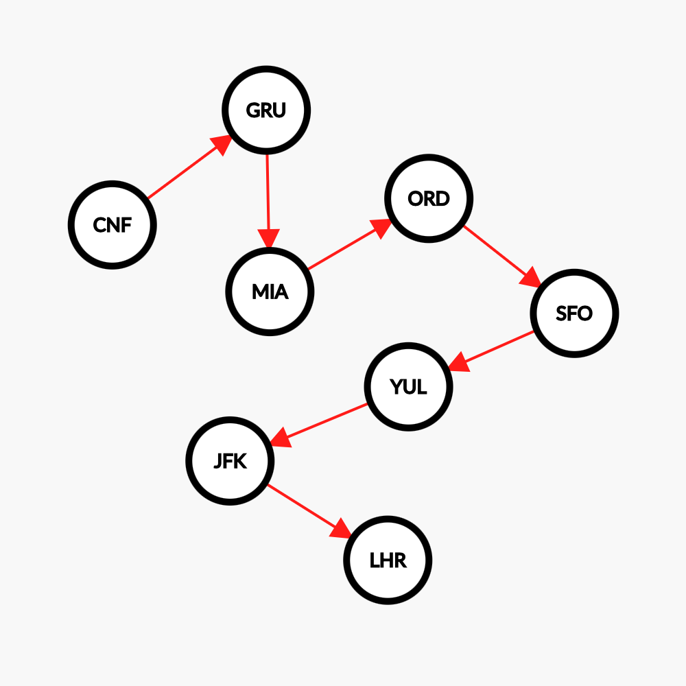

# Flight Path Tracker

There are over 100,000 flights a day, with millions of people and cargo being transferred around the world. With so many people and different carrier/agency groups, it can be hard to track where a person might be. In order to determine the flight path of a person, we must sort through all of their flight records.

The goal is to create a simple microservice API that can help us understand and track how a particular person's flight path may be queried. The API should accept a request that includes a list of flights, which are defined by a source and destination airport code. These flights may not be listed in order and will need to be sorted to find the total flight paths starting and ending airports.

For example:

```
• [["SFO", "EWR"]]                                                 => ["SFO", "EWR"]
• [["ATL", "EWR"], ["SFO", "ATL"]]                                 => ["SFO", "EWR"]
• [["IND", "EWR"], ["SFO", "ATL"], ["GSO", "IND"], ["ATL", "GSO"]] => ["SFO", "EWR"]
```

## Instructions

Install Go 1.22, and the Make tool. Then run:

```shell
$ make build
$ make run
```

It will start the HTTP server on port 8080 on localhost.

#### Examples

The folder `examples/` contains a list of sample HTTP requests using cURL. After starting the server, feel free to execute those samples.

#### Running tests

```shell
$ make test
```

## API Specification

### Definitions

Flight Leg ([source](https://aviation.stackexchange.com/questions/14567/what-is-the-difference-between-slice-segment-and-leg)):
> A flight is defined by the IATA as the operation of one or more flight legs with the same flight designator. Unlike a flight segment, a flight may involve one or more aircraft. The IATA defines a leg as the operation of an aircraft from one scheduled departure station to its next scheduled arrival station. A flight segment can include one or more legs operated by a single aircraft with the same flight designator.

### The `/calculate` endpoint

This endpoint expects a JSON payload containing the list of flight legs that are part of a given flight itinerary.

It will return a flight path object, listing the origin and destination airports, and a **sorted** list of flight legs, as shown below.

```
POST /calculate

Content-Type: application/json

{
    "flight_legs": [
        ["IND", "EWR"], 
        ["SFO", "ATL"], 
        ["GSO", "IND"], 
        ["ATL", "GSO"]
    ]
}

200 OK

{
    "origin": "SFO",
    "destination": "EWR",
    "flight_legs": [
        ["SFO", "ATL"],
        ["ATL", "GSO"],
        ["GSO", "IND"],
        ["IND", "EWR"]
    ]
}
```

#### Constraints and validations

- At least one flight leg must be provided.
- A flight leg must be declared as a list of two strings.
- A flight leg cannot point to itself. The following will throw an error: `["JFK", "JFK"]`
- No loops or branches shall be present in the path. The implementation will raise an error if it detects any loops. We detect loops or branches by checking the presence of multiple inbound or outbound flight legs for any given airport code.

#### Security considerations

For security reasons, we are not accepting or returning a JSON array in the HTTP request or response bodies. This is to avoid [JSON Hijacking](https://stackoverflow.com/questions/43717574/javascript-why-shouldnt-the-server-respond-with-a-json-array), a common exploit.

Instead, we are using a JSON object, and the array is embedded as a property.

### Errors

The API will obey to the [HTTP response status code convention](https://developer.mozilla.org/en-US/docs/Web/HTTP/Status). More specifically, it will return:

- `400 Bad Request` for malformed JSON payloads and invalid inputs

Errors should be returned using the following JSON structure:

```json
{
    "error": true,
    "retryable": false,
    "message": "unable to unmarshal flight leg ..."
}
```

## TODO & Roadmap

- [ ] Validate if the airport code is not empty. In fact, giving an empty airport code could make the flight path calculation loop forever. The server is susceptible to DoS attacks.
- [ ] Validate if the airport code is 3-letters per the IATA airport code specification
- [ ] Add logging.
- [ ] Add `context.WithTimeout` and check if the context was canceled during the path calculation to avoid unnecessary work.
- [ ] Persist the `FlightPath` entity in a relational database, along with the flight legs. Each airport code could be a unique entry in an `airports` table.


## Solution Design

If we are only concerned about finding the *start* (the origin) and *end* (the final destination) airport codes, a simple solution can be devised.

We are going to model the problem as a [directed graph](https://en.wikipedia.org/wiki/Directed_graph), or *digraph*, where:

- Airport codes are the vertexes
- Flight legs are the edges
- The direction of a flight leg is the direction of the corresponding edge

That way, the problem input:

```
["CNF", "GRU"],
["GRU", "MIA"],
["YUL", "JFK"],
["MIA", "ORD"],
["JFK", "LHR"],
["SFO", "YUL"],
["ORD", "SFO"]
```

Can be represented as:



Once this structure is built, then finding the start and end airport codes is a trivial task:

- The *start* is the vertex that has no _inbound_ edge in the digraph
- Similarly, the *end* is the vertex that has no _outbound_ edge in the digraph

This has a time complexity of:
```
O(|V| × |E])
```
where `|V|` is the number of vertexes, or airport codes; `|E|` is the number of edges, or flight legs.

### Finding the sorted flight path

Once we have built the digraph and determined the start and end nodes, sorting the flight legs becomes a problem of finding a path between the start and end nodes.

To accomplish that, we can leverage the [Dijkstra's algorithm](https://en.wikipedia.org/wiki/Dijkstra's_algorithm), with a few simplifications: 
- All edges have the same cost, i.e., there's no need to calculate the cost of a path.
- We can assume that, for any given vertexes, there's going to be at most one inbound edge, and at most one outbound edge. That means only one path should exist for a valid input.

The time complexity of Dijkstra's original algorithm is:
```
Θ(|V|²)
```
But that can be optimized if we use priority queues.

---